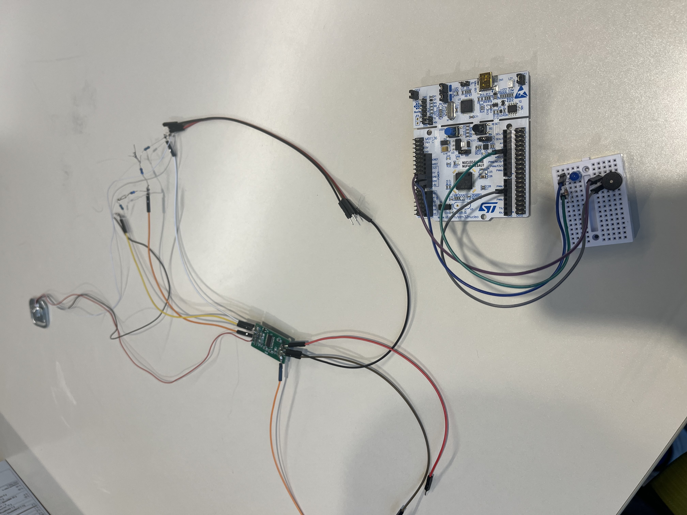
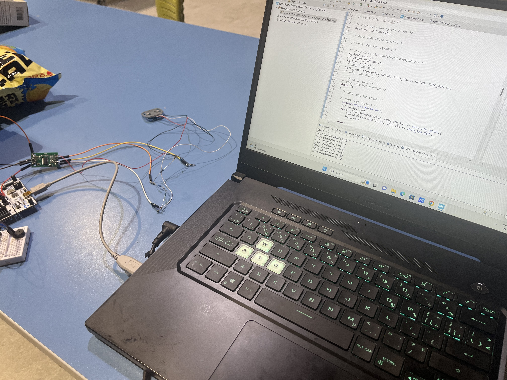
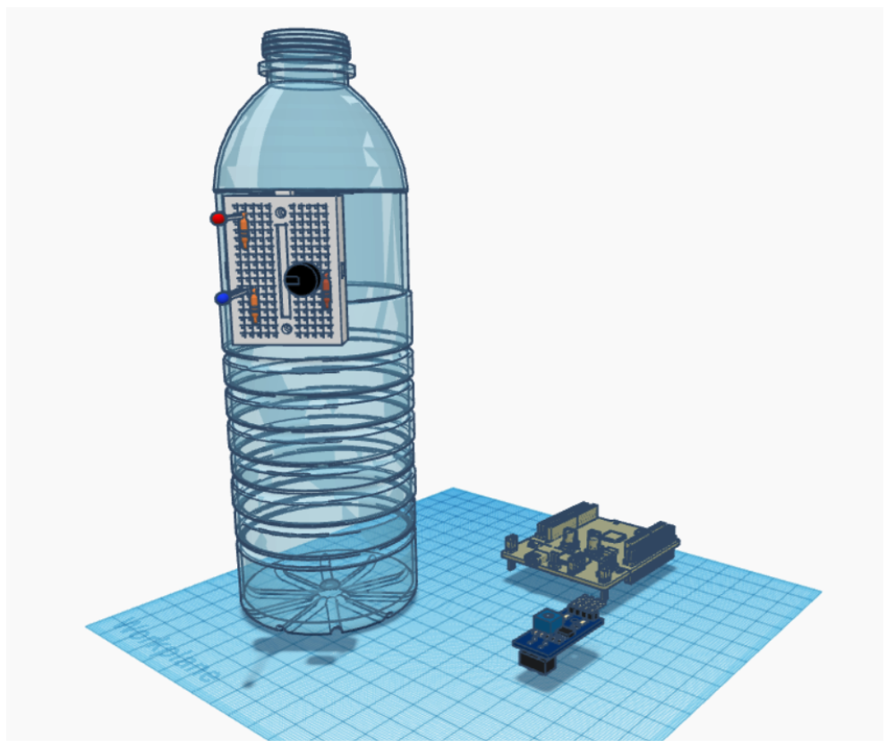
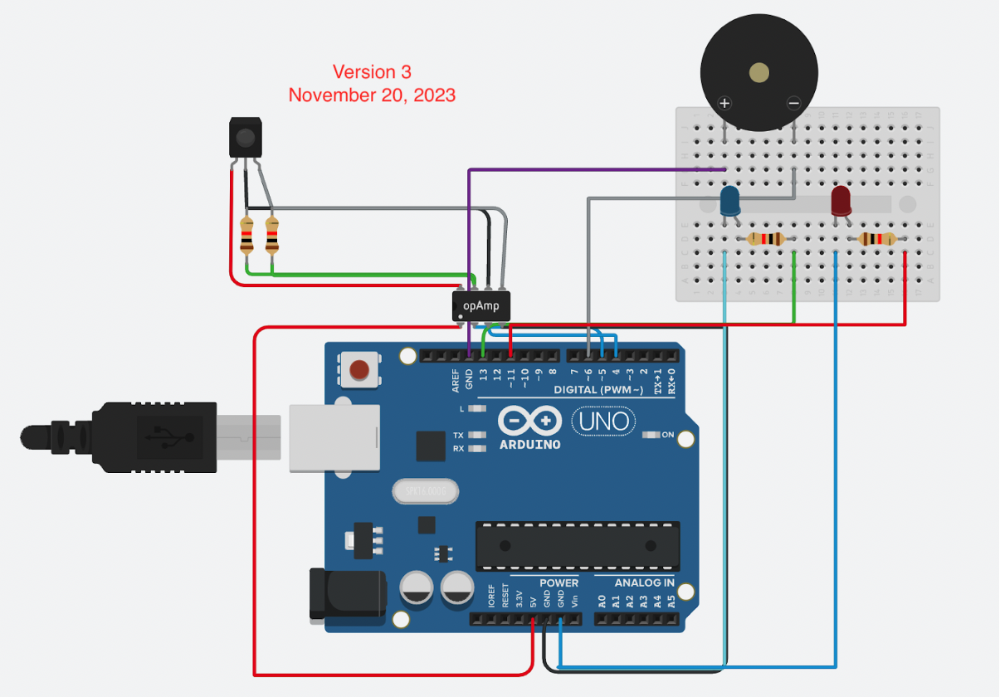
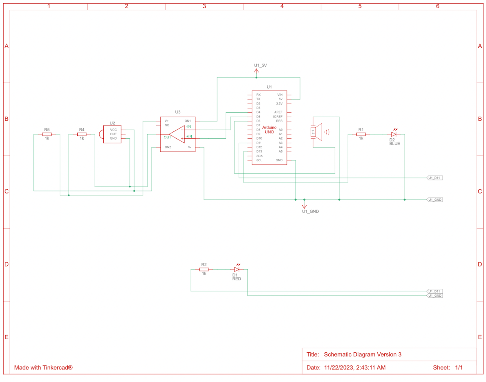

# Water-Level-Tracker

The water level tracker project is designed to monitor and track water consumption from a 500mL bottle, providing feedback and reminders to the user. 

## Project Description

Here's what the project does:

1. **Measurement Precision:** It accurately measures water consumption from the specified bottle with a precision of the nearest mL.

2. **Gender Identification:** LED indicators differentiate between male and female settings, allowing users to set their calculation mode.

3. **Daily Intake Target:** A second LED indicates when the user reaches their daily intake target, based on scientific recommendations for gender and age group.

4. **Reminder System:** A buzzer creates a sound if the water level remains unchanged for more than 30 minutes, reminding the user to drink water.

5. **Portability:** The system is designed to be portable, with considerations for size, weight, and power requirements. It effectively seals itself to prevent water leakage during transportation.

6. **Technical Implementation:** It utilizes an STM32F401RE board connected to a pressure sensor and other components. The load cell sensor accurately tracks the weight within the bottle. User feedback is provided through LED lights and a buzzer, with a button for interaction.

7. **Program Functionality:** The program running on the STM32 board reads the weight of the water in the bottle using a load cell sensor, handles user input for different intake recommendations, tracks time for reminder purposes, and activates LEDs when daily intake goals are met.

Overall, the project ensures accurate monitoring of water consumption, tailored to individual needs, while promoting hydration through timely reminders and feedback.

### Layout of Hardware Components:

Mechanical drawing:

System architecture drawing:

Electrical Schematic Diagram: 

## Demonstration of the project:

## Project Members
[Melania Yoo](https://github.com/melaniayoo/) &amp; [Allan Su](https://github.com/tudourocky/)
